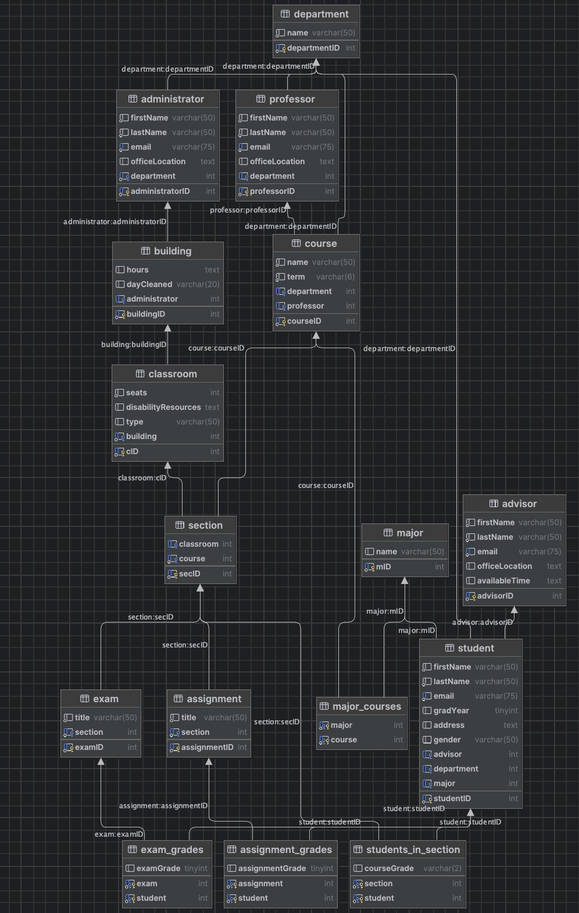

# MySQL + Flask Boilerplate Project

This repo contains a boilerplate setup for spinning up 3 Docker containers:

1. A MySQL 8 container for obvious reasons
1. A Python Flask container to implement a REST API
1. A Local AppSmith Server

## How to setup and start the containers

**Important** - you need Docker Desktop installed

1. Clone this repository.
1. Create a file named `db_root_password.txt` in the `secrets/` folder and put inside of it the root password for MySQL.
1. Create a file named `db_password.txt` in the `secrets/` folder and put inside of it the password you want to use for the a non-root user named webapp.
1. In a terminal or command prompt, navigate to the folder with the `docker-compose.yml` file.
1. Build the images with `docker compose build`
1. Start the containers with `docker compose up`. To run in detached mode, run `docker compose up -d`.

##Project Overview
This app makes course registration and management easy and add it all to one single application. It uses a MySQL database and flask for the backend. The frontend of the app is created using App smith.

Link to video project overview - https://youtu.be/f77u2JSHgTU

##Database design -
The db folder contains our generated data and table definitions for the registrar app. This information is in `db/registrar.sql`. The data definitions result in the following database diagram -

